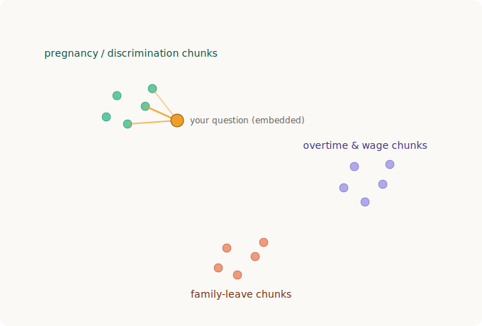
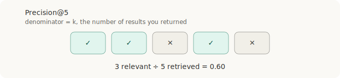
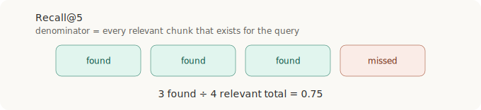
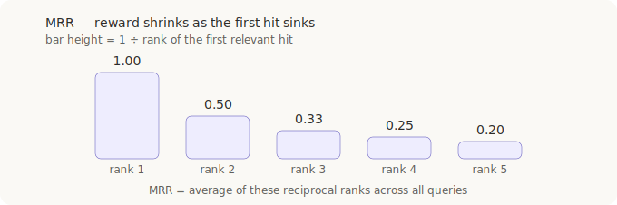

# Day 3 — Embeddings & Retrieval Baseline

Personal educational notes for the LegalEval project. Not legal advice.

---

## Vector store choice

- FAISS flat `IndexFlatIP` over ChromaDB at this scale. 664 chunks is
  tiny, so brute-force exact search is instant; FAISS keeps the
  embed → index → search → map steps explicit (pedagogical). Chroma's
  edges (metadata filtering, free persistence) aren't Day 3 needs.

## Embeddings

- An embedding turns text into a fixed-length vector; similar meaning
  lands as nearby points. Topics self-organise into clusters, and a
  question lands nearest the chunks that answer it (the amber links).

- Dimension is bundled with the model (384 for `all-MiniLM-L6-v2`), not
  chosen by hand — bigger ≠ better; let evaluation decide if a larger
  model earns its cost.
- Query and chunks MUST use the same model, or distances are meaningless
  (different spaces).
- Normalize to unit length so dot product = cosine similarity — the
  `IndexFlatIP` setup.

## Retrieval mechanics

- The index is the searchable collection of chunk vectors; "flat" =
  compare the query against all vectors exactly.
- top-k returns the k nearest chunks; k is a tunable knob (Day 8 compares
  values).
- With FAISS you own the chunk↔vector alignment: records saved in embed
  order, so a hit's row id maps back via `records[id]`.

## Reading similarity scores

- Cosine score (0–1) is a within-query ranking signal, not a universal
  grade. Scale is model-specific; the gap between rank 1 and the pack
  matters more than the absolute; relevance is the real target.

## Evaluation metrics

All require a labelled "golden" set: which chunks are relevant per
question. The rank is the retriever's OUTPUT; the labels are the INPUT.
Building this golden set is the Day 5 prerequisite.

**Precision@k** — of what you returned, the fraction that is relevant.
Denominator is k. Answers "how clean is my result list?"

**Recall@k** — of all relevant chunks that exist, the fraction you
surfaced in the top k. Denominator is the total relevant set. The RAG
priority, since you can't cite what you didn't retrieve.

**MRR** — looks only at the rank of the first relevant hit, scores it
1 ÷ rank, and averages across queries. Rewards a good source landing
high; ignores everything after the first hit.

**Others** — F1@k (balances precision/recall), MAP (rank-aware over all
relevant items), nDCG (rank-aware + graded relevance), Hit@k (any
relevant chunk in the top k, pass/fail).

## Retrieval families

- Keyword (lexical): BM25/TF-IDF match exact terms; sparse vectors;
  strong on citations/defined terms, blind to synonyms (fired vs
  termination).
- Dense (built today): embeddings match meaning; strong on paraphrase,
  can blur exact rare tokens.
- Hybrid: run both, merge (e.g. reciprocal rank fusion); fits legal
  because queries carry intent AND exact tokens, and a wrong section cite
  is a real error — so exact matching isn't optional.

## Carry-forward limitation

- SCOTUS opinion chunks show `source_url = PLACEHOLDER_URL`; real URLs
  must be filled before the citation layer (Days 4–5) for verifiable
  citations.

## Build proof (done, committed)

- `embedder.py`, `build_index.py` (664 vectors, dim 384), `retriever.py`,
  `sample_questions.py` (12 questions),
  `docs/examples/retrieval_examples.json`.
